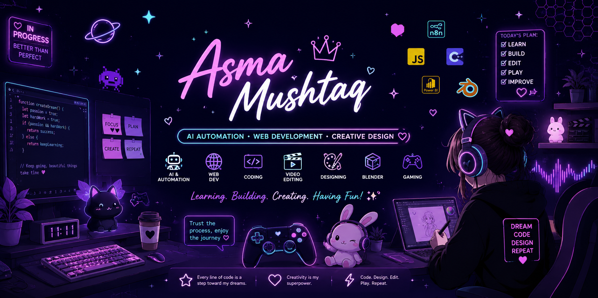

<p align="center">
  
</p>


<h1 align="center">Hi 👋, I'm Asma Mushtaq</h1>

<h3 align="center">
✨ Future AI & Automation Engineer | Web Developer | Creative Designer ✨
</h3>

<p align="center">

</p>

<p align="center">

</p>

---

# 🌸 About Me

💜 Hi! I'm **Asma Mushtaq**.

I'm passionate about combining **technology and creativity** to build useful, beautiful, and innovative digital experiences.

🌱 **Currently Learning**

* 🤖 n8n Automation
* 🌐 Website Development
* 💻 C++
* 📊 Power BI

🎨 **Creative Interests**

* 🎬 Video Editing
* 🖌️ Graphic Designing
* 🧊 Blender (3D)
* 🎨 UI Inspiration

🎮 **Fun Side**

* 🎮 Gaming
* 🤖 Exploring AI Tools
* 📚 Learning New Technologies
* 💡 Building Creative Projects

---

# 🛠️ Skills & Tools

### 💻 Development

* 🌐 Website Development
* 💻 C++
* ⚡ n8n Automation

### 📊 Data & Analytics

* 📈 Power BI

### 🎬 Video Editing

* 🎥 Wondershare Filmora
* 🎞️ Adobe Premiere Pro
* 🎨 Adobe Photoshop (Basic)
* 🎬 Content Editing

### 🎨 Design & Creativity

* 🖌️ Graphic Design
* 🎨 Canva
* 🧊 Blender (Learning)
* ✨ UI Design

### 🧰 Tools

* Git
* GitHub
* VS Code

---

# 📈 GitHub Stats

<p align="center">


</p>

---

# 🔥 GitHub Streak

<p align="center">


</p>

---

# 🎯 Current Goals

* 🚀 Build real-world n8n automations
* 🌐 Develop modern websites
* 📊 Master Power BI dashboards
* 🎬 Improve professional video editing skills
* 🧊 Learn Blender for 3D design
* 🤝 Contribute to open-source projects
* 💜 Keep learning something new every day

---

# 💖 Fun Facts

```text
🎮 Gamer at heart
🎬 I enjoy creating and editing videos
🎨 Design inspires my creativity
🤖 AI fascinates me
☕ Coffee + Music = Productivity
🚀 Always learning, always improving
```

---

# 🌐 Connect With Me

<p align="center">
<a href="https://github.com/AsmaMushtaq-666">

</a>
</p>

---

<div align="center">

### 💜 Thanks for visiting my profile!

*"Dream • Learn • Build • Repeat"* ✨

⭐ My repositories may be few today, but every project marks another step in my learning journey. Stay tuned as I continue building, creating, and growing!

</div>
